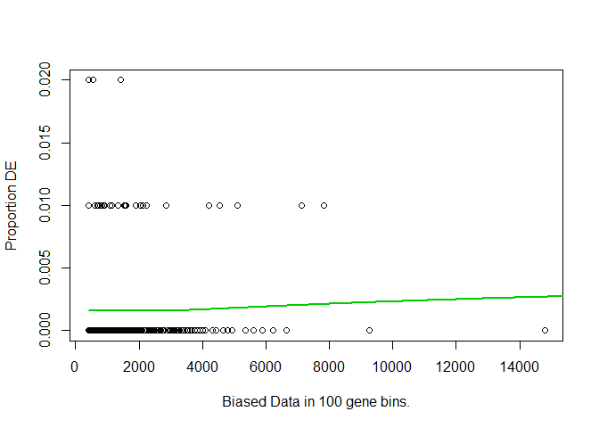

Working with GOSeq to do GO Term Analysis
================

This is a step-by-step walkthrough of how to perform GO term enrichment
analysis on a non-model organism using the R package goseq from
Bioconductor.

Important pre goseq steps – you need a gene-to-GOterm map which is a
list of gene identifiers and an associated GO identifier. If you produce
it with my python script, GoTermsMap.py, it looks like
this:

``` 
 ECEF_Abd_TRINITY_DN10037_c0_g1  GO:0006807-nitrogen compound metabolic process(L=2)
 ECEF_Abd_TRINITY_DN10037_c0_g1  GO:0007154-cell communication(L=2)
 ECEF_Abd_TRINITY_DN10037_c0_g1  GO:0009058-biosynthetic process(L=2)
 ECEF_Abd_TRINITY_DN10037_c0_g1  GO:0044237-cellular metabolic process(L=2)
 ECEF_Abd_TRINITY_DN10037_c0_g1  GO:0044238-primary metabolic process(L=2)
 ECEF_Abd_TRINITY_DN10037_c0_g1  GO:0044700-single organism signaling(L=2)
 ECEF_Abd_TRINITY_DN10037_c0_g1  GO:0044710-single-organism metabolic process(L=2)
 ECEF_Abd_TRINITY_DN10037_c0_g1  GO:0044763-single-organism cellular process(L=2)
 ECEF_Abd_TRINITY_DN10037_c0_g1  GO:0050789-regulation of biological process(L=2)
 ECEF_Abd_TRINITY_DN10037_c0_g1  GO:0051716-cellular response to stimulus(L=2)
 ECEF_Abd_TRINITY_DN10037_c0_g1  GO:0071704-organic substance metabolic process(L=2)
 ECEF_Abd_TRINITY_DN10037_c0_g1  GO:0043227-membrane-bounded organelle(L=2)
 ECEF_Abd_TRINITY_DN10037_c0_g1  GO:0044421-extracellular region part(L=2)
```

but will need to be edited so that it looks more like
    this:

    ECEF_Abd_TRINITY_DN10037_c0_g1  GO:0006807-nitrogen compound metabolic process(L=2) GO:0006807
    ECEF_Abd_TRINITY_DN10037_c0_g1  GO:0007154-cell communication(L=2)                  GO:0007154
    ECEF_Abd_TRINITY_DN10037_c0_g1  GO:0009058-biosynthetic process(L=2)                GO:0009058

That is to say, goseq wants just the GO identifier and not the verbose
category. If you are feeling clever, you can just fix it in R with
regular expressions.

You will also need a gene id to gene length map. I decided the best way
to get this was to go to one of my sample’s genes.results output
produced from the Trinity RSEM/edgeR DE Analysis scripts. I did `cut
-f 1,4` to get the gene identifier and the effective length out of a
genes.results file.

What you input to R should look like this:

    gene_id                         length
    ECEF_Abd_TRINITY_DN10007_c0_g1  1148.00
    ECEF_Abd_TRINITY_DN10023_c0_g1  463.00
    ECEF_Abd_TRINITY_DN10037_c0_g1  425.00
    ECEF_Abd_TRINITY_DN10037_c0_g2  554.00
    ECEF_Abd_TRINITY_DN10038_c0_g1  1041.00
    ECEF_Abd_TRINITY_DN10044_c0_g1  1605.00
    ECEF_Abd_TRINITY_DN10046_c0_g1  1211.00
    ECEF_Abd_TRINITY_DN10056_c0_g1  1544.00

With that preliminary input information, we are ready to examine GO term
enrichment with goseq\!

``` r
options(stringsAsFactors = FALSE) # this just always seems to help me. 
library("goseq")
```

    ## Loading required package: BiasedUrn

    ## Loading required package: geneLenDataBase

    ## 

``` r
library("dplyr")
```

    ## 
    ## Attaching package: 'dplyr'

    ## The following objects are masked from 'package:stats':
    ## 
    ##     filter, lag

    ## The following objects are masked from 'package:base':
    ## 
    ##     intersect, setdiff, setequal, union

I’m going to read in my DE analysis
results…

``` r
resdata <- read.table("C:/Users/cruth/Google Drive/Treehoppers/ResearchFiles/RNASeq/GeneExpression_2018/EC_DESeq2_resdata.tab", header=TRUE, sep="\t")
```

Not included in this walkthrough are the creation of the DESeq object,
doing the DE analysis, the creation of the resdata dataframe, and
writing that dataframe to a file. We only needed to do that once, and
it’s time intensive to repeat. I’ll just read in the data we saved
earlier. Right now, I’m only using it as a way to get the length of a
vector and to pick some example gene
ids.

### Here are all of the steps necessary for getting GO enrichment from a list of DE features.

1)  Make a vector the same length as the number of ids. All values will
    be 0.

<!-- end list -->

``` r
  gene.data <- integer(length=length(resdata$EC_id))
```

2)  Name the items in the vector with gene ids.

<!-- end list -->

``` r
names(gene.data) <- 
  resdata$EC_id
```

3)  Get a list of gene ids from SOMEWHERE – here, the top 30 values for
    ECEF Abd in resdata

<!-- end list -->

``` r
 topAbd <- arrange(resdata, ECEF_Abd) %>% top_n(30, ECEF_Abd)
 topAbd_ids <- topAbd$EC_id

AbdUp <- topAbd_ids
```

4)  Use a for loop to find which element in the genes vector has the
    same name as one of the gene ids in our list, and sets its value to
    1.

<!-- end list -->

``` r
for (item in AbdUp) {
  i <- which(names(gene.data)==item)
  gene.data[i] <- 1
}
```

5)  Check to make sure that the number of IDs you selected equals the
    number that are now set to 1 in genes

<!-- end list -->

``` r
table(gene.data)
```

    ## gene.data
    ##     0     1 
    ## 18645    30

``` r
length(AbdUp) == table(gene.data)[2]
```

    ##    1 
    ## TRUE

6)  Then omit NAs (probably skippable because of how we created the
    vector, but could be a problem for other means.)

<!-- end list -->

``` r
genes.list <- na.omit(gene.data)
```

7)  Get the feature length data and the category mapping data. Filter
    with dplyr to just be for the genes in our genes
list.

<!-- end list -->

``` r
feature.lengths <- read.table("../GOAnalysis/ECEF_Genes_Lengths.txt", header=TRUE, sep="\t")
cat.map <- read.table("../GOAnalysis/ECEF_GoTerm_Extended.txt", header=FALSE, sep="\t")
GoCats <- cat.map[,c(1,3)]

genes.length.data <- filter(feature.lengths, gene_id %in% names(genes.list))
```

8)  Make the length data into a vector with names.

<!-- end list -->

``` r
genes.bias.data <- genes.length.data$length
names(genes.bias.data) <- genes.length.data$gene_id
```

9)  Fit the probability weighting function and then plot
    it.

<!-- end list -->

``` r
pwf <- nullp(genes.list, bias.data = genes.bias.data, plot.fit = FALSE)
```

    ## Warning in pcls(G): initial point very close to some inequality constraints

``` r
plotPWF(pwf = pwf, binsize = 100) # <-- you can change the binsize if you like, bins of 200 genes seems good to me. 
```

<!-- -->

10) Perform the Wallenius test (use the goseq function) to get the most
    enriched go
cats

<!-- end list -->

``` r
GO.wall <- goseq(pwf, gene2cat = GoCats, method = "Wallenius", use_genes_without_cat = FALSE)
```

    ## Using manually entered categories.

    ## For 9464 genes, we could not find any categories. These genes will be excluded.

    ## To force their use, please run with use_genes_without_cat=TRUE (see documentation).

    ## This was the default behavior for version 1.15.1 and earlier.

    ## Calculating the p-values...

    ## 'select()' returned 1:1 mapping between keys and columns

Done. Save the data to a tab file to use for making graphics outputs.

``` r
write.table(GO.wall, "AbdUp_GOterms.wall.tab", sep="\t")
getwd()
```

    ## [1] "C:/Users/cruth/Google Drive/Treehoppers/ResearchFiles/RNASeq/GeneExpression_2018"

### And let’s take a look at the top twenty, shall we?

``` r
library(dplyr)
sorted.GO <- arrange(GO.wall, GO.wall$over_represented_pvalue) 

sorted.GO
```

    ##       category over_represented_pvalue under_represented_pvalue numDEInCat
    ## 1   GO:0042302            4.189228e-06               0.99999993          4
    ## 2   GO:0044421            9.433435e-05               0.99999450          5
    ## 3   GO:0042221            2.952566e-03               0.99949435          7
    ## 4   GO:0009605            3.455863e-03               0.99945735          6
    ## 5   GO:0043234            4.533398e-03               0.99905088          9
    ## 6   GO:0060361            2.519673e-02               0.99971993          1
    ## 7   GO:0008307            4.553681e-02               0.99904728          1
    ## 8   GO:0044700            7.039349e-02               0.97762676          6
    ## 9   GO:0044767            7.351987e-02               0.97361227          9
    ## 10  GO:0016043            7.457992e-02               0.97361351          8
    ## 11  GO:0007154            8.117343e-02               0.97317955          6
    ## 12  GO:0043228            1.258734e-01               0.95615901          5
    ## 13  GO:0048856            1.537212e-01               0.93388265          9
    ## 14  GO:0006457            1.579737e-01               0.98767105          1
    ## 15  GO:0009056            2.573098e-01               0.90736700          3
     
``` r
#What are the top 20 over represented GOTerms?
sorted.GO[,c(1,6)]
```
      ## category	         term
      ## 1 GO:0042302	     structural constituent of cuticle
      ## 2 GO:0044421	     extracellular region part
      ## 3 GO:0042221	     response to chemical
      ## 4 GO:0009605	     response to external stimulus
      ## 5 GO:0043234	     <NA>
      ## 6 GO:0060361	     flight
      ## 7 GO:0008307	     structural constituent of muscle
      ## 8 GO:0044700	     <NA>
      ## 9 GO:0044767	     <NA>
      ## 10 GO:0016043	  cellular component organization
      ## 11 GO:0007154	  cell communication
      ## 12 GO:0043228	  non-membrane-bounded organelle
      ## 13 GO:0048856	  anatomical structure development
      ## 14 GO:0006457	  protein folding
      ## 15 GO:0009056	  catabolic process
      ## 16 GO:0044707	  <NA>
      ## 17 GO:0044763	  <NA>
      ## 18 GO:0065008	  regulation of biological quality
      ## 19 GO:0044464	  cell part
      ## 20 GO:0051641	  cellular localization

Note – for some reason, many of the GOterms that EnTAP assigned are
deprecated, or maybe just not meant to be used the way we’re using them,
and so they show up as NAs. Those GOTerms can be searched on the Amigo
browser and you can find a redirect to the current ontology version. For
example, <GO:0043234> was replaced by <GO:0032991>, protein-containing
complex, a cellular component term.

That’s all\! The hard part is deciding *which* set of genes to examine.
