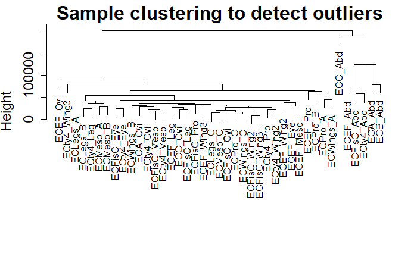
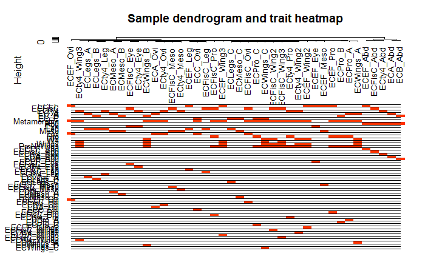

WGCNA Module 1
================
C. R. Fisher
1/25/2020

This tutorial is based on Steve Horvath’s tutorials set available at
[Horvath
Genetics@UCLA](https://horvath.genetics.ucla.edu/html/CoexpressionNetwork/Rpackages/WGCNA/).
However, this tutorial is based on data from a smaller RNA-Seq study
involving comparisons between and among different body parts, rather
than comparisons between different clinical traits. I also demonstrate
how to add annotations generated by the [EnTAP
pipeline](https://entap.readthedocs.io/en/latest/introduction.html). In
the final module, we use the annotations to make transcript lists
suitable for GO Term enrichment analysis using my [GoSeq
Walkthrough](https://github.com/fishercera/TreehopperSeq/blob/master/GoSeq_Walkthrough.md).

-----

## Setting Up The Data

This WGCNA pipeline needs as input:

  - Transcript abundance estimates: Preferably, use a matrix of TPM
    values for each transcript for each sample, such as that generated
    by the script abundance\_estimates\_to\_matrix.pl in the Trinity
    transcriptome assembly and analysis package. See [Trinity Transcript
    Quantitation](https://github.com/trinityrnaseq/trinityrnaseq/wiki/Trinity-Transcript-Quantification)
    if you need more information about how to generate transcript
    abundance estimates for your samples.

  - A set of annotations for the transcriptome assembly, with the
    following columns: `"id", "BLASTp.Hit", "OrthoSeed", "Descrip1",
    "Descrip2", "Protein.Family", "GO.BP", "GO.CC", "GO.MF",
    "IPRO.descrip", "PF.descrip"` This can be generated from a .tsv file
    generated by EnTAP using `cut` in bash: `cut
    -f 1,13,19,25,26,27,28,29,30,32,34` Then add the above column names
    as a header row.

  - A file containing sample information with the traits/conditions for
    each sample, tab delimited. For example:

<!-- end list -->

    Sample  Species Tissue_Abd  Tissue_Eye  Pool_ECEF
    ECEF_Abd    1           1           0           1
    ECEF_Eye    1           0           1           1
    ECEF_Leg    1           0           0           1
    ECEF_Meso   1           0           0           1
    ECEF_Ovi    1           0           0           1
    ECEF_Pro    1           0           0           1
    ECEF_Wing2  1           0           0           1
    ECEF_Wing3  1           0           0           1

There are some important considerations in creating this file for your
own data set. I will discuss at greater length when we get there.

  - A file named WGCNA\_Config.txt. This file should be just one line,
    with the following four pieces of information, tab separated:
    `filename.TPM.matrix filename.Traits.txt output_basename
    annotations.tsv`

All of these files should be in the same directory as the WGCNA pipeline
scripts. Output will all be placed in the same directory, using the
basename as a file prefix.

## Step 0: Load library, read config file, and set environment variables.

``` r
# Load the WGCNA package
library(WGCNA)

options(stringsAsFactors = FALSE) # This is important, do not omit it. 
#allowWGCNAThreads(nThreads = 32)  # This first module doesn't require multiple processors

Config <- read.delim("WGCNA_Config.txt", header=FALSE, sep="\t")
infile <- Config$V1
traitfile <- Config$V2
basename <- Config$V3
annots <- Config$V4
```

## Step 1: Load the data

``` r
Data = read.delim(infile, sep="\t", header=TRUE)
##take a quick look at the data set:
dim(Data)
```

    ## [1] 19975    42

``` r
names(Data)
```

    ##  [1] "X"            "ECA_Abd"      "ECA_Ovi"      "ECB_Abd"      "ECC_Abd"     
    ##  [6] "ECC_Ovi"      "ECEF_Abd"     "ECEF_Eye"     "ECEF_Leg"     "ECEF_Meso"   
    ## [11] "ECEF_Ovi"     "ECEF_Pro"     "ECEF_Wing2"   "ECEF_Wing3"   "ECFisC_Abd"  
    ## [16] "ECFisC_Eye"   "ECFisC_Leg"   "ECFisC_Meso"  "ECFisC_Ovi"   "ECFisC_Pro"  
    ## [21] "ECFisC_Wing2" "ECFisC_Wing3" "ECLegs_A"     "ECLegs_B"     "ECLegs_C"    
    ## [26] "ECMeso_A"     "ECMeso_B"     "ECMeso_C"     "ECPro_A"      "ECPro_B"     
    ## [31] "ECPro_C"      "ECty4_Abd"    "ECty4_Eye"    "ECty4_Leg"    "ECty4_Meso"  
    ## [36] "ECty4_Ovi"    "ECty4_Pro"    "ECty4_Wing2"  "ECty4_Wing3"  "ECWings_A"   
    ## [41] "ECWings_B"    "ECWings_C"

## Step 2: Rearrange and manipulate the data

We only want columns with counts in our data matrix.

``` r
datExpr0 = as.data.frame(t(Data[,-1]))
names(datExpr0) = Data$X
rownames(datExpr0) = names(Data[,-1])
```

## Step 3: Run in the built-in data conformity check.

``` r
gsg = goodSamplesGenes(datExpr0, verbose = 3)
```

    ##  Flagging genes and samples with too many missing values...
    ##   ..step 1
    ##   ..Excluding 4 genes from the calculation due to too many missing samples or zero variance.
    ##   ..step 2

``` r
gsg$allOK
```

    ## [1] FALSE

``` r
if (!gsg$allOK)
{
  # Optionally, print the gene and sample names that were removed:
  if (sum(!gsg$goodGenes)>0) 
    printFlush(paste("Removing genes:", paste(names(datExpr0)[!gsg$goodGenes], collapse = ", ")));
  if (sum(!gsg$goodSamples)>0) 
    printFlush(paste("Removing samples:", paste(rownames(datExpr0)[!gsg$goodSamples], collapse = ", ")));
  # Remove the offending genes and samples from the data:
  datExpr0 = datExpr0[gsg$goodSamples, gsg$goodGenes]
}
```

    ## Removing genes: ECEF_Eye_TRINITY_DN20454_c0_g1_i3, ECEF_Ovi_TRINITY_DN20616_c0_g3_i1, ECEF_Pro_TRINITY_DN22353_c0_g2_i1, ECEF_Leg_TRINITY_DN24639_c0_g1_i5

## Step 4: Cluster the samples to check for outliers

We build a dendrogram of the samples, based on a simple distance matrix
of the expression data. The samples that are very distinct from others
will not cluster well in this dendrogram, and might need to be excluded
from further analysis.

``` r
sampleTree = hclust(dist(datExpr0), method = "average")

plot(sampleTree, main = "Sample clustering to detect outliers", sub="", xlab="", cex.lab = 1.5, 
     cex.axis = 1.5, cex.main = 2)
```

<!-- -->

Based on what we already know about this data this dendrogram doesn’t
look very surprising to us. We know that the abdominal samples are the
most different from everything else, and that there’s a few
sample-specific biases that we have to control for when we do
differential expression analysis. The only one we might exclude is
ECC\_Abd – it seems to be pretty distinct from the other abdominal
samples.

``` r
rownames(datExpr0)
```

    ##  [1] "ECA_Abd"      "ECA_Ovi"      "ECB_Abd"      "ECC_Abd"      "ECC_Ovi"     
    ##  [6] "ECEF_Abd"     "ECEF_Eye"     "ECEF_Leg"     "ECEF_Meso"    "ECEF_Ovi"    
    ## [11] "ECEF_Pro"     "ECEF_Wing2"   "ECEF_Wing3"   "ECFisC_Abd"   "ECFisC_Eye"  
    ## [16] "ECFisC_Leg"   "ECFisC_Meso"  "ECFisC_Ovi"   "ECFisC_Pro"   "ECFisC_Wing2"
    ## [21] "ECFisC_Wing3" "ECLegs_A"     "ECLegs_B"     "ECLegs_C"     "ECMeso_A"    
    ## [26] "ECMeso_B"     "ECMeso_C"     "ECPro_A"      "ECPro_B"      "ECPro_C"     
    ## [31] "ECty4_Abd"    "ECty4_Eye"    "ECty4_Leg"    "ECty4_Meso"   "ECty4_Ovi"   
    ## [36] "ECty4_Pro"    "ECty4_Wing2"  "ECty4_Wing3"  "ECWings_A"    "ECWings_B"   
    ## [41] "ECWings_C"

``` r
rownames(datExpr0)[-4]
```

    ##  [1] "ECA_Abd"      "ECA_Ovi"      "ECB_Abd"      "ECC_Ovi"      "ECEF_Abd"    
    ##  [6] "ECEF_Eye"     "ECEF_Leg"     "ECEF_Meso"    "ECEF_Ovi"     "ECEF_Pro"    
    ## [11] "ECEF_Wing2"   "ECEF_Wing3"   "ECFisC_Abd"   "ECFisC_Eye"   "ECFisC_Leg"  
    ## [16] "ECFisC_Meso"  "ECFisC_Ovi"   "ECFisC_Pro"   "ECFisC_Wing2" "ECFisC_Wing3"
    ## [21] "ECLegs_A"     "ECLegs_B"     "ECLegs_C"     "ECMeso_A"     "ECMeso_B"    
    ## [26] "ECMeso_C"     "ECPro_A"      "ECPro_B"      "ECPro_C"      "ECty4_Abd"   
    ## [31] "ECty4_Eye"    "ECty4_Leg"    "ECty4_Meso"   "ECty4_Ovi"    "ECty4_Pro"   
    ## [36] "ECty4_Wing2"  "ECty4_Wing3"  "ECWings_A"    "ECWings_B"    "ECWings_C"

``` r
datExpr0 <- datExpr0[-4,]
```

## Step 5: Read in trait data for all samples

WGCNA is built for large RNA-Seq/microarray experiments using lots of
samples that are related to lots of clinical trait data. In my
experiment, which is an evolutionary morphology study, we don’t have
clinical traits; the primary dimension our samples differ in is which
body part they’re taken from and which specimen pool they belong to.
Therefore instead of having quantitative trait data like weight, height,
hormone levels, etc., I have a lot of discrete, categorical data.

In exploring how WGCNA behaves, I’ve determined that categorical data is
best input in a binary format. I have a column for each possible
category a sample can belong to, and a `1` or a `0` denoting whether or
not a given sample is in that category. I have also found that WGCNA can
be somewhat sensitive to sample-specific effects, and so I have included
sample identity as distinct categories. The upshot of this is that I
have an extremely wide ‘trait’ matrix. We’ll see how this effects things
in the next module.

``` r
traitData = read.delim(traitfile, sep="\t", header=TRUE)
dim(traitData)             ## How many rows/columns in the traitData?
```

    ## [1] 41 59

``` r
names(traitData)           ## What are the column names? 
```

    ##  [1] "Sample"       "ECEF"         "ECFisC"       "ECty4"        "EC_A"        
    ##  [6] "EC_B"         "EC_C"         "Metamorphic"  "Abd"          "Eye"         
    ## [11] "Leg"          "Meso"         "Ovi"          "Pro"          "W2"          
    ## [16] "W3"           "Wings"        "ProNWings"    "ECEF_Abd"     "ECFisC_Abd"  
    ## [21] "ECty4_Abd"    "ECA_Abd"      "ECB_Abd"      "ECC_Abd"      "ECEF_Eye"    
    ## [26] "ECFisC_Eye"   "ECty4_Eye"    "ECEF_Leg"     "ECFisC_Leg"   "ECty4_Leg"   
    ## [31] "ECLegs_A"     "ECLegs_B"     "ECLegs_C"     "ECEF_Meso"    "ECFisC_Meso" 
    ## [36] "ECty4_Meso"   "ECMeso_A"     "ECMeso_B"     "ECMeso_C"     "ECEF_Ovi"    
    ## [41] "ECFisC_Ovi"   "ECty4_Ovi"    "ECA_Ovi"      "ECC_Ovi"      "ECEF_Pro"    
    ## [46] "ECFisC_Pro"   "ECty4_Pro"    "ECPro_A"      "ECPro_B"      "ECPro_C"     
    ## [51] "ECEF_Wing2"   "ECFisC_Wing2" "ECty4_Wing2"  "ECEF_Wing3"   "ECFisC_Wing3"
    ## [56] "ECty4_Wing3"  "ECWings_A"    "ECWings_B"    "ECWings_C"

``` r
traitData$Sample           ## What are the library names? 
```

    ##  [1] "ECEF_Abd"     "ECEF_Eye"     "ECEF_Leg"     "ECEF_Meso"    "ECEF_Ovi"    
    ##  [6] "ECEF_Pro"     "ECEF_Wing2"   "ECEF_Wing3"   "ECFisC_Abd"   "ECFisC_Eye"  
    ## [11] "ECFisC_Leg"   "ECFisC_Meso"  "ECFisC_Ovi"   "ECFisC_Pro"   "ECFisC_Wing2"
    ## [16] "ECFisC_Wing3" "ECty4_Abd"    "ECty4_Eye"    "ECty4_Leg"    "ECty4_Meso"  
    ## [21] "ECty4_Ovi"    "ECty4_Pro"    "ECty4_Wing2"  "ECty4_Wing3"  "ECLegs_A"    
    ## [26] "ECLegs_B"     "ECLegs_C"     "ECMeso_A"     "ECMeso_B"     "ECMeso_C"    
    ## [31] "ECPro_A"      "ECPro_B"      "ECPro_C"      "ECWings_A"    "ECWings_B"   
    ## [36] "ECWings_C"    "ECA_Abd"      "ECA_Ovi"      "ECB_Abd"      "ECC_Abd"     
    ## [41] "ECC_Ovi"

``` r
# remove columns that hold information we do not need.
allTraits = traitData[-40,-24] #Removing ECC_Abd
dim(allTraits)                ## How many rows/columns are left?
```

    ## [1] 40 58

``` r
names(allTraits)              ## What are the column names? 
```

    ##  [1] "Sample"       "ECEF"         "ECFisC"       "ECty4"        "EC_A"        
    ##  [6] "EC_B"         "EC_C"         "Metamorphic"  "Abd"          "Eye"         
    ## [11] "Leg"          "Meso"         "Ovi"          "Pro"          "W2"          
    ## [16] "W3"           "Wings"        "ProNWings"    "ECEF_Abd"     "ECFisC_Abd"  
    ## [21] "ECty4_Abd"    "ECA_Abd"      "ECB_Abd"      "ECEF_Eye"     "ECFisC_Eye"  
    ## [26] "ECty4_Eye"    "ECEF_Leg"     "ECFisC_Leg"   "ECty4_Leg"    "ECLegs_A"    
    ## [31] "ECLegs_B"     "ECLegs_C"     "ECEF_Meso"    "ECFisC_Meso"  "ECty4_Meso"  
    ## [36] "ECMeso_A"     "ECMeso_B"     "ECMeso_C"     "ECEF_Ovi"     "ECFisC_Ovi"  
    ## [41] "ECty4_Ovi"    "ECA_Ovi"      "ECC_Ovi"      "ECEF_Pro"     "ECFisC_Pro"  
    ## [46] "ECty4_Pro"    "ECPro_A"      "ECPro_B"      "ECPro_C"      "ECEF_Wing2"  
    ## [51] "ECFisC_Wing2" "ECty4_Wing2"  "ECEF_Wing3"   "ECFisC_Wing3" "ECty4_Wing3" 
    ## [56] "ECWings_A"    "ECWings_B"    "ECWings_C"

``` r
# Form a data frame analogous to expression data that will hold the clinical traits.
Samples = rownames(datExpr0)  
traitRows = match(Samples, allTraits$Sample)  ## Get re-ordering for the trait data. 
datTraits = allTraits[traitRows, -1]     ## Need this matrix to just be trait columns
rownames(datTraits) = allTraits[traitRows, 1] ## Making the rownames the libraries' names. 

collectGarbage() # This is a WGCNA function that fixes some memory-hog problems it has. 
```

## Step 6: Recluster samples

We’re also going to add a simple heatmap to the dendrogram so that we’ve
got a visual of what ‘traits’ each sample has and how those traits break
down.

``` r
sampleTree2 = hclust(dist(datExpr0), method = "average")

traitColors = numbers2colors(datTraits, signed = TRUE);
# Plot the sample dendrogram and the colors underneath.

plotDendroAndColors(sampleTree2, traitColors,
                    groupLabels = names(datTraits), 
                    main = "Sample dendrogram and trait heatmap")
```

<!-- -->

Because the trait matrix is so big, the tree gets a little squashed when
we add the traits below it. But this does give us a feel for the kinds
of raw similarity between different samples that look important just in
terms of the distance matrix. Honestly, there’s not a lot of strong
pattern. \`

The trait matrix is *not* used by WGCNA in determining modules. The
trait matrix is used after module detection, in order to try to make
biological sense of what the modules are. Part 2 of this tutorial is
module detection, and Part 3 is correlating modules with trait data. But
for now, we’ve got our expression data and trait data in the right
formats for WGCNA to operate on, so we’re going to save those in an
RData file to load in Part 2.

``` r
save(datExpr0, datTraits, file = paste(basename, "WGCNA.RData", sep="_"))
```
